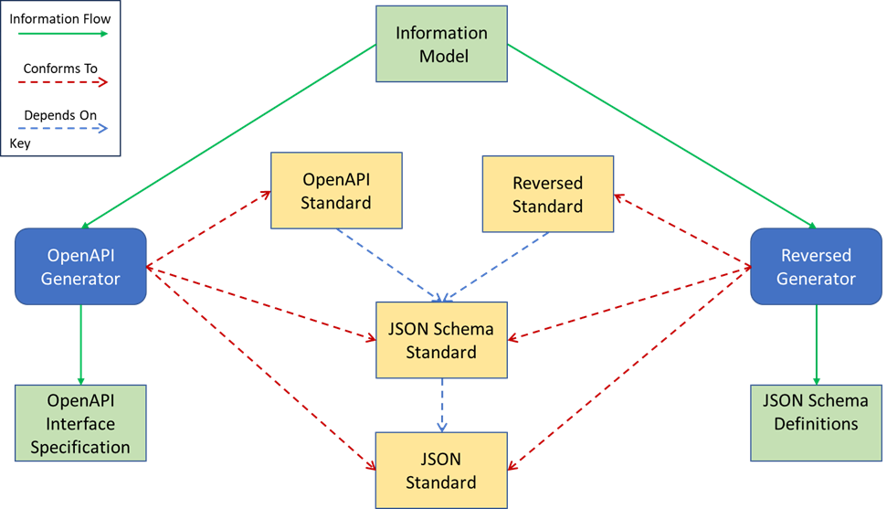

#### Developing New Generators

As described in [MTT Overview](/learn/mtt-overview), a core design principle of the MTT Internal Model is to make adding new Generators, flexible, quick and easy.

However, creating a new Generator does require some key information to be available as described and illustrated below. The figure aims to bring out two key points, using the OpenAPI and Reversed standards as examples:

1. **Dependencies between standards**. As shown, the OpenAPI standard and the Reversed standard depend on the [JSON Schema Standard](https://json-schema.org/l) and the [JSON Standard](https://www.json.org/json-en.html) for their syntax.
2. **Generators must to conform to all relevant standards**. As shown, both the OpenAPI and Reversed standards depend on the lower-level JSON and JSON-Schema standard, for the format (syntax) of the generated files, but it is the higher-level OpenAPI and Reversed standards that define the structure (semantics) of what the generators must produce. 

    <figure class="figure">
        
        <figcaption class="figure-caption">Generator Dependencies</figcaption>
    </figure>

