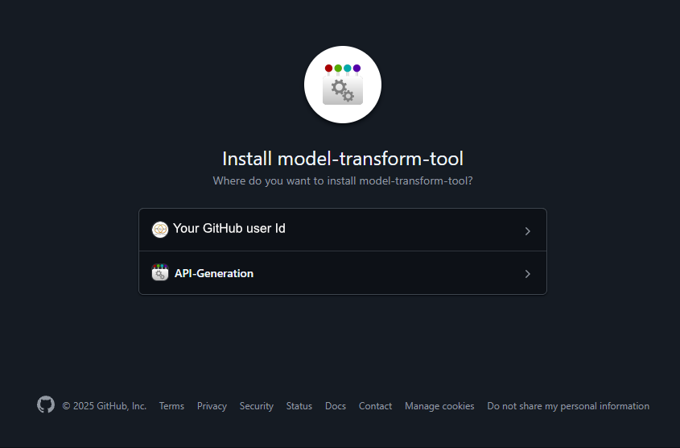
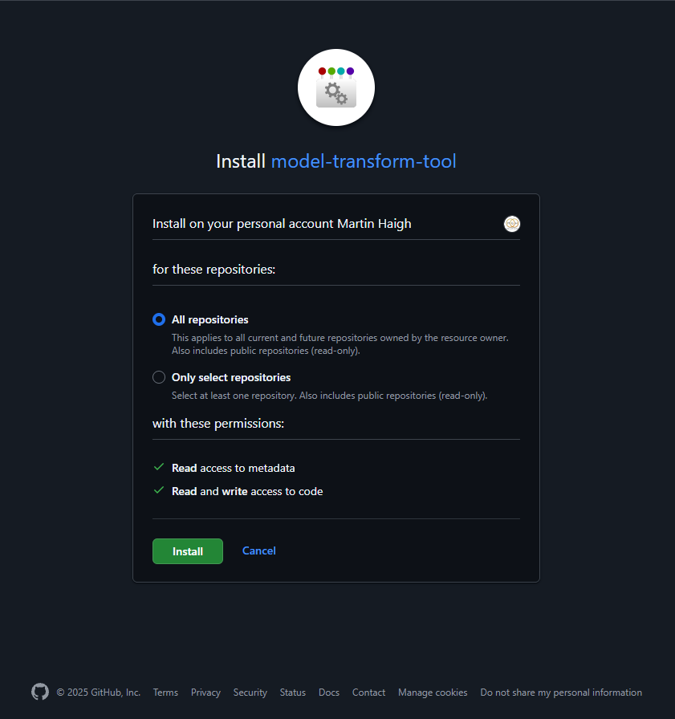
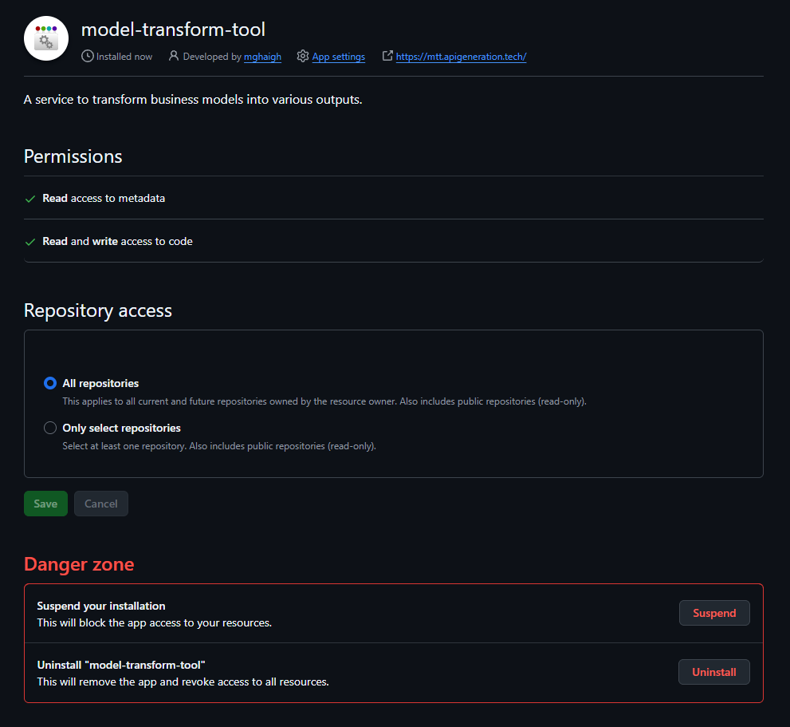
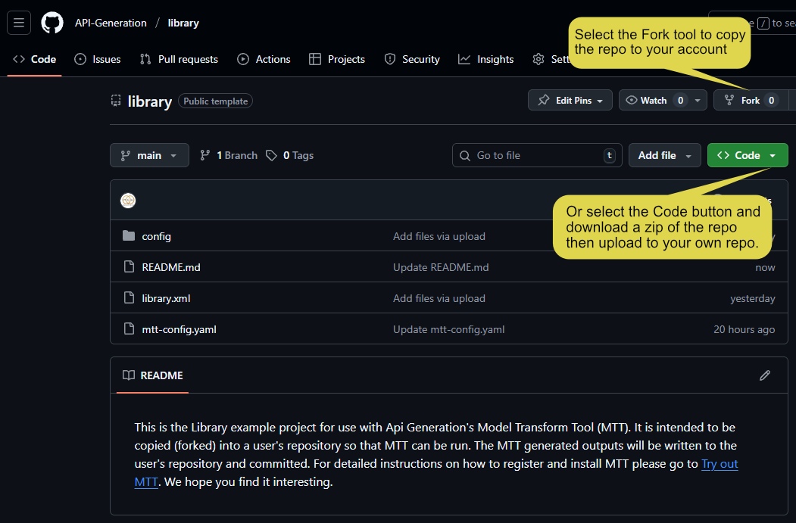
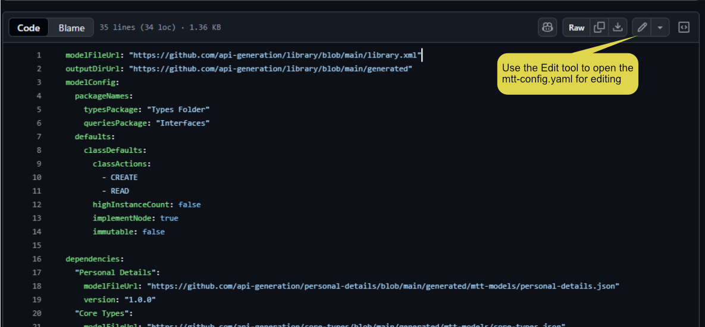
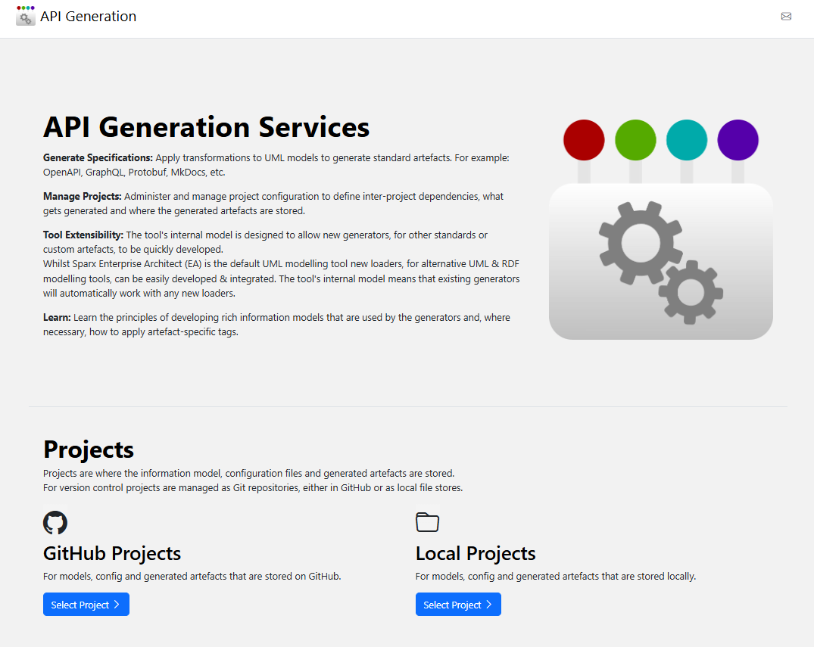
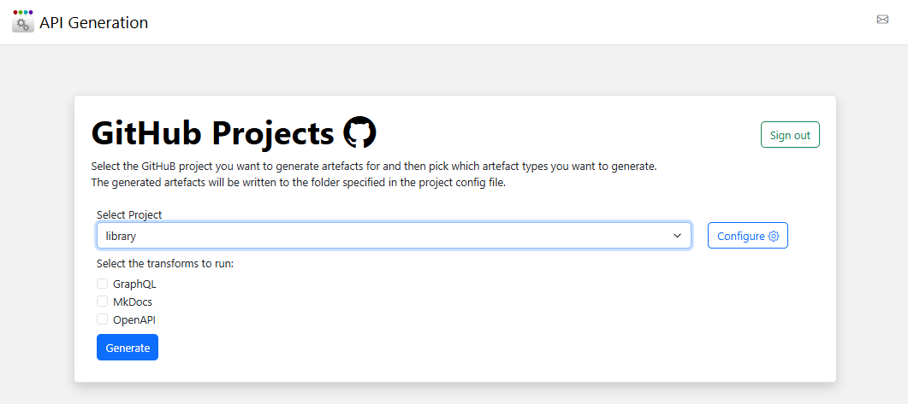

## Options to try MTT out. A Test

There are two options for seeing what MTT can do for you:

1) Browse the [example projects](/learn/projects)  and the outputs generated from the models. These projects include everything you need to get a feeling for both the information models used as input to the MTT and the range and quality of the generated outputs. 
2) Follow the instructions to enable the MTT as a trial GitHub app. Note you may need to register for an API Generation’s account if you haven’t already got one. This will enable you to run MTT on information models in your own GitHub account & commit the generated outputs  to your GitHub account on a trial basis. The trial models can have a maximum of seven classes, API Generation’s core-types library can be the only dependency and each registered user can run the MTT a maximum of 5 times. To start creating your own model library & generating outputs from it, sign up at GitHub marketplace. 

## Use MTT as a GitHub App

To set up MTT, as a GitHub App, and generate outputs complete the following steps:

### Add MTT as a GitHub App

Follow the <a href="https://github.com/apps/model-transform-tool/installations/new" target="_blank">MTT Installation</a> link to start the GitHub App installation process. 

This starts with a page to choose which GitHub account to install MTT onto. The example below shows both personal and organisation accounts being available.

<figure class="figure ">
  
  <figcaption class="figure-caption">Install MTT onto a GitHub account</figcaption>
</figure>

Selecting an account provides control of which repositories MTT can access and shows which permissions MTT requires. Selecting Install 

<figure class="figure ">
  
  <figcaption class="figure-caption">Select repositories and permissions</figcaption>
</figure>

If 2FA is enabled on the GitHub account (recommended) then verify that MTT should be allowed access to the repos.

<figure class="figure ">
  
  <figcaption class="figure-caption">Confirm acess to Repos</figcaption>
</figure>

If everything has gone correctly then the final screen summarises the MTT installation and provides options to disable or remove the MTT App.

<figure class="figure ">
  
  <figcaption class="figure-caption">MTT intalled on GitHub account</figcaption>
</figure>

### Run MTT on example project

To run MTT on an example project, in your GitHub repository follow the steps below:

Go to the <a href="https://github.com/API-Generation/library" target="_blank">Library repository</a>. This should display the Library project files.

<figure class="figure ">
  
  <figcaption class="figure-caption">Library example project repo</figcaption>
</figure>

Either 'Fork' or download a zip of the library repo. If you've used a download then the files will need to be uploaded to your own repository.

In GitHub, edit the **mtt-config.yaml** file and make the changes shown below and commit the updates.

<figure class="figure ">
  
  <figcaption class="figure-caption">Edit mtt-config.yaml</figcaption>
</figure>

Go to the [MTT home page](https://mtt.apigeneration.tech) which should display the the page below.

<figure class="figure ">
  
  <figcaption class="figure-caption">MTT Home page</figcaption>
</figure>

Click on 'Select Project' under GitHub Projects and it should show the page below.

<figure class="figure ">
  
  <figcaption class="figure-caption">Select project and generators</figcaption>
</figure>

Check the generators you want to run and once the MTT generators have completed a run summary page should be displayed with links to the outputs committed to GitHub.

**Note:** If you check MKDocs then a large number of files are generated and written to GitHub. This can take several minutes so please be patient; it's saving you a lot of work.

